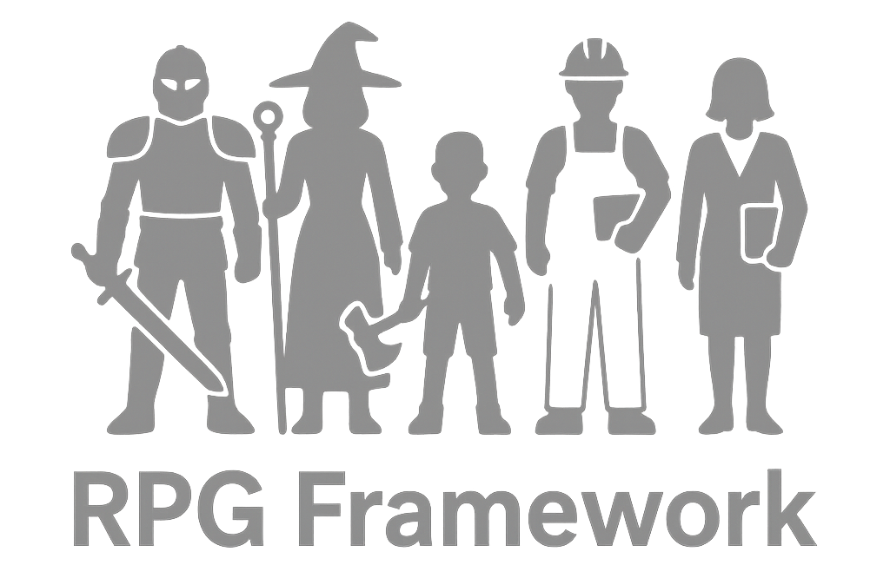

<p align="center">
    
</p>

# RPG Framework
## Overview
RPG Framework is a simple-to-use Python program that lets you create your own console + GUI based RPGs for fun. This program is still under development, and is currently built for recreational development.

The framework comes with minigames, battle systems, inventory systems, and party systems pre-built. Furthermore, the code itself is easily expandable such that you can construct practically any RPG system you want to.

## Features
- A ready-to-use system for RPGs and simple Text Adventures.
- A unique combat system that is similar to some other RPGs like Live a Live.
- Minigame systems that let you create mock-up QTEs.
- An inventory management system similar to games like Resident Evil.
- Containers that make it easy to create chests and closets.
- The Python console for user input, as well as a Pygame GUI for displaying information and story to the player.
- An easily expandable set of systems that let you make whatever systems you want to.

## Requirements
All you need is Python 3.12 or any higher version in order to run and use the framework.

## Installation
Clone this git repository, or simply download the "framework" folder and the "main.py" file to start working on your RPG game.

## Usage
For simplistic text adventures and RPGs, you'll mainly be working outside of the framework. RPG Framework relies primarily on a functional programming style, where choices calls different functions. For example, below is a simple example of how to make a basic choice in a text adventure:

```python
def coffeShop(game: Game):
    game.clearStory()
    game.writeText("You walk into a busy coffee shop. It's getting dark outside.")

    game.showImage("images/coffee_shop.png")
    
    game.writeText("In front of you, you can see someone sleeping at the front desk, and around you there appear to be various couples and employees living through their lives.")

    result = choice({
        "Talk to the cashier": cashier_talk,
        "Sit at an empty seat": empty_seat,
        "Look outside": look_outside
    })

    result(game)

def cashier_talk(game: Game):
    ... # Next scenario goes here.

def empty_seat(game: Game):
    ... # Next scenario goes here.

def look_outside(game: Game):
    ... # Next scenario goes here.
```

### Using the Game Class
The game class should be passed into any functions or classes you create, as it holds all of the variables and functions nearly everything in the game will use. It also handles what the Pygame window shows the player.

The Pygame window is split into two halves - the story section (the larger area) and the info section (the smaller section on the side). The story section is for story, the info section is for things like showing the player their party's statistics and inventory.

There are various functions that let you edit the Pygame window through the game class:

- ```game.writeText(text: str)``` - Write text to the story section of the Pygame window.

- ```game.showImage(path: str)``` - Given a path to the image, display it in the Pygame window. The width of the image is automatically scaled to fit within the story section.

- ```game.clearStory()``` - Clears the story area. Best used after the player makes a choice in order to display the next section.

- ```game.infoText()``` - Write text to the info section of the Pygame window.

- ```game.clearInfo()``` - Clear all of the text within the info section.

You can also create child classes of the Game class in order to keep track of other variables throughout the game. Alternatively, you can directly edit the game class itself if you download the Framework.

### Characters and Party
The character party is kept track of through a list in "game.party", which holds instances of the Character class. Each character can have their own statistics and values, and making child classes of the main Character class lets you give characters unique traits and abilities specific to them.

Inventory is handled by each character, and so each one has their own inventory to manage. Their carry capacity is how many STACKS of items they can hold. Each item can stack multiple times to a given quantity, and each stack occupies a different amount of space. So one apple in a character's inventory would take the same amount of space as a hundred apples assuming the Apple item can stack up to at least a hundred times. You can use functions like ```addItem```, ```countItems``` and ```removeItems``` to manage a character's inventory.

Their actions in combat is handled through the functions ```onBeginAction```, ```startAction```, and ```doingAction```. Each one can be found within the character class, and examples of pre-existing actions can be found there as well. The key thing to handle is ```self.heldAction```, which is used by the battle manager when determining what a character is doing. ```type``` should be CHARACTER for any actions specific to that character, or ITEM if it's an item action. ```item_reference``` is a reference to an item if the character is attacking with an item. ```data``` can be used to store specific pieces of information (like the target enemy). And ```display``` is the actual thing displayed to the player when the character is performing their action. ```self.battleDelay``` is used to determine how long it'll take for them to perform their action, how long they're performing their action, and how long it'll take for them to recover from their action.

### Items
Items are held in a character's inventory, and can be interacted with. through various ways. Similar to characters, items each have their own ```battleActions```, but they also have their own ```standardActions``` that can be used for when the character is using an item outside of combat.

The carry cost and maximum quantity determines how much each stack of this item costs in terms of inventory space, as well as how large each stack of this item can be. Note that each item keeps track of its quantity seperately.

### Enemies
Mainly used in combat, enemies are like Characters who lack several features and are used mainly in combat encounters. Anything that is controlled by the program should be implemented as an enemy, effectively. They share many similarities to characters, having almost everything but an inventory pre-implemented.

### Battles
Battles can be started through doing the folloinwg:

```python
newBattle = Battle(game, [Enemy1(game), Enemy2(game)])
newBattle.startBattle()
```

Battles are handled through a "step" system. Each action enemies and those in the party take require "steps" to process. Each action has a number of wind-up steps, action steps, and wind-down steps. This effectively does make the game turn-based, but also makes it more free-flowing at the same time. For an example of how combat is handled, look at games such as "Live a Live".

### Containers
Containers are useful for storing items and creating treasure chests. Using them is also rather simple:

```python
closet = Container(game, "Closet", [Sword(game), Crossbow(game)])

# Adding five arrows to the container.
closet.addItem(Arrow(game), 5)

# Opening the closet.
closet.openContainer()
```

Containers can also have an optional maximum quantity that they can hold, stored in ```maxStorage```. If the maximum storage is set to a negative number, then the contaier is presumed to have infinite storage space. They can also be locked, and you can remove the options to take items or store items in a container if you wish to by editing ```canTake``` and ```canStore```.

### Minigames
Minigames are useful for if you want to add a sort of "QTE" moment to your game, making the player play a small minigame in order to achieve something. All minigames take place in the console, and return a value that you can then use to decide the player's success.

- ```mashMinigame(givenTime: float, useSpace: bool)``` - The player must mash a button as fast as they can in the given time. If useSpace is set to false, then the player must alternate between pressing A and D instead of just mashing space. The return value is the number of key presses in the given time. Note that time is measured in 0.1 intervals.

- ```reactionMinigame()``` - A simple reaction-based minigame. The player waits for a signal, and presses space as fast as they can. The return value is the reaction time of the player. Note that if the player holds or mashes space before they're told to, they're given a penalty for each frame they had space pressed when they were supposed to just wait.

- ```timingMinigame(targetPercentage: int, speed: int)``` - A timing minigame, where the player must press space when the displayed number is as close to the target as possible. The return value is the distance between the target value and the final value the player obtained.

You can use minigames like so:

```python
os.system("cls")

game.writeText("You attempt to pry open the door...")
input("Press enter to continue...")

result = mashMinigame(3, True)

if result >= 30:
    doorOpen(game)

else:
    doorFail(game)
```

### Utility Functions
Various utility functions (found in ```util.py```) exist to aid you with programming your game:

- ```neatPrint(inp: str, wrapLength: int = 80)``` - Displays information neatly in the console with auto-wrap for the text.

- ```choice(choices, displayChoices = True)``` - Displays a set of choices that the user can pick from, automatically clearing the console and looping until a valid choice is made. The choices should be a dictioanry of type string --> any, and the return value is the value of the chosen key from the dictionary.

- ```noLoopChoice(choices, showIndexes = True)``` - Similar to choice, but does not clear the screen, and does not loop. Instead, it just returns (None, None) if an invalid choice was made. Returns a tuple, with the first value being the index chosen, and the second being the value of the chosen key.

- ```inventoryManagement(game: Game)``` - Opens a screen that lets you manage the party's inventory, interacting with items and doing actions with them. Extremely useful, especially if you have a lot of items and want to let your player constantly interact with their inventory.

- ```romanNumeralConversion(inputNumber: int)``` - Returns the roman numeral version of a given number. Anything equal to or below zero just returns "0".

## Contributions
Contributions to the project are always welcome, especially contributions that implement new features that can be used basically anywhere (so more minigames, extra interactables like doors or articles, and more).

## License
RPG Framework is released under the [MIT License](LICENSE.md).